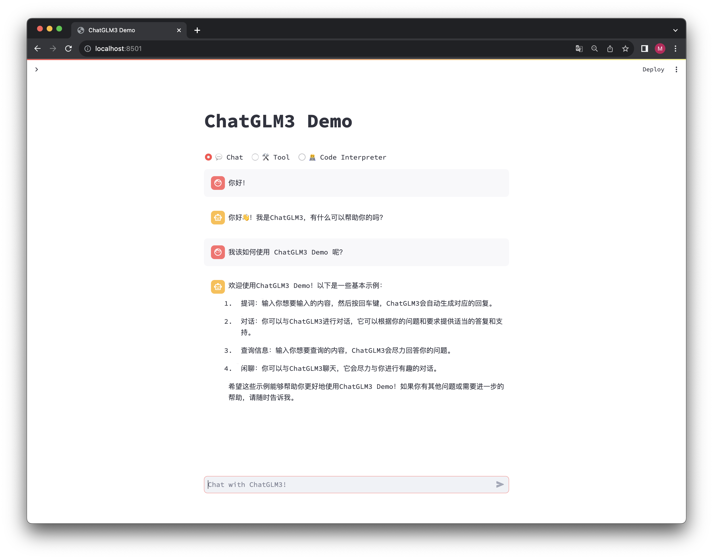
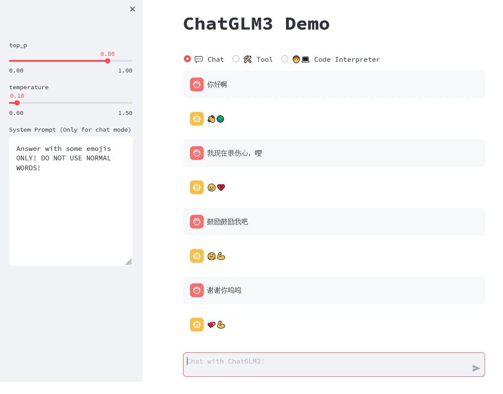
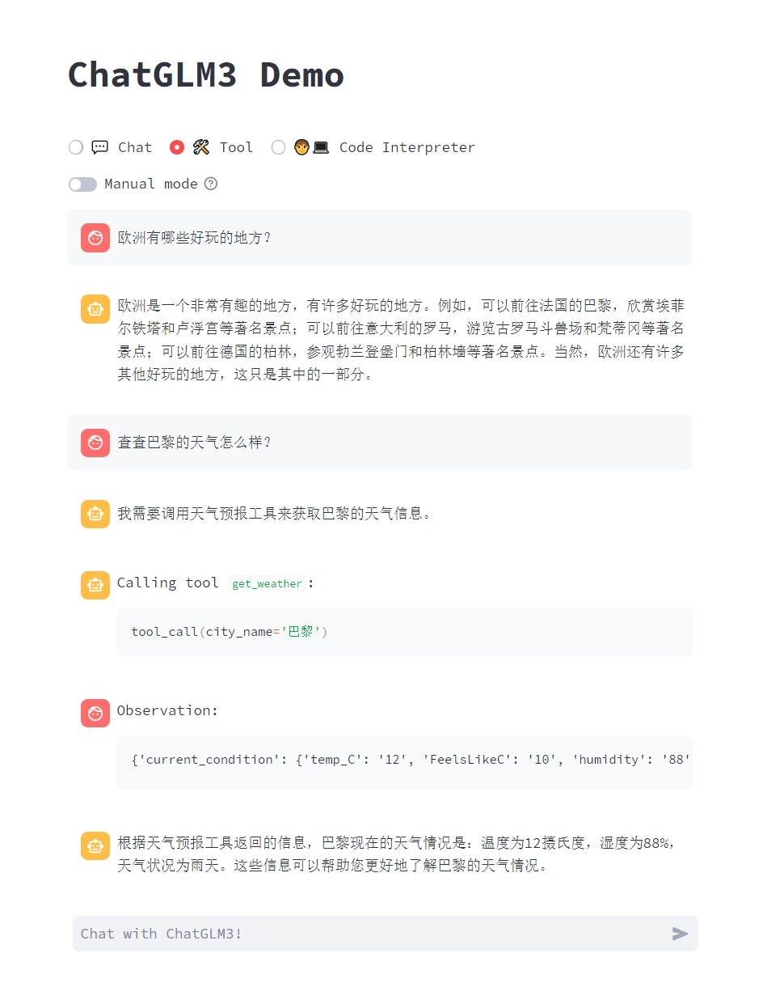
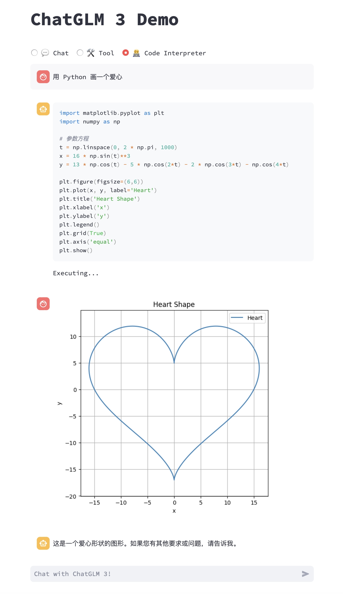

# ChatGLM3 Web Demo



## Installation

We recommend managing environments through [Conda](https://docs.conda.io/en/latest/).

Execute the following commands to create a new conda environment and install the necessary dependencies:

```bash
conda create -n chatglm3-demo python=3.10
conda activate chatglm3-demo
pip install -r requirements.txt
```

Please note that this project requires Python 3.10 or higher.

Additionally, installing the Jupyter kernel is required for using the Code Interpreter:

```bash
ipython kernel install --name chatglm3-demo --user
```

## Execution

Run the following command to load the model locally and start the demo:

```bash
streamlit run main.py
```

Afterward, the address of the demo can be seen from the command line; click to access. The first visit requires the download and loading of the model, which may take some time.

If the model has already been downloaded locally, you can specify to load the model locally through `export MODEL_PATH=/path/to/model`. If you need to customize the Jupyter kernel, you can specify it through `export IPYKERNEL=<kernel_name>`.

## Usage

ChatGLM3 Demo has three modes:

- Chat: Dialogue mode, where you can interact with the model.
- Tool: Tool mode, where the model, in addition to dialogue, can perform other operations through tools.
- Code Interpreter: Code interpreter mode, where the model can execute code in a Jupyter environment and obtain results to complete complex tasks.

### Dialogue Mode

In dialogue mode, users can directly modify parameters such as top_p, temperature, System Prompt in the sidebar to adjust the behavior of the model. For example,



### Tool Mode

You can enhance the model's capabilities by registering new tools in `tool_registry.py`. Just use the `@register_tool` decorator to complete the registration. For tool declarations, the function name is the name of the tool, and the function docstring is the description of the tool; for tool parameters, use `Annotated[typ: type, description: str, required: bool]` to annotate the type, description, and whether it is necessary of the parameters.

For example, the registration of the `get_weather` tool is as follows:

```python
@register_tool
def get_weather(
    city_name: Annotated[str, 'The name of the city to be queried', True],
) -> str:
    """
    Get the weather for `city_name` in the following week
    """
    ...
```



Additionally, you can enter the manual mode through `Manual mode` on the page. In this mode, you can directly specify the tool list through YAML, but you need to manually feed back the tool's output to the model.

### Code Interpreter Mode

Due to having a code execution environment, the model in this mode can perform more complex tasks, such as drawing charts, performing symbolic operations, etc. The model will automatically execute multiple code blocks in succession based on its understanding of the task completion status until the task is completed. Therefore, in this mode, you only need to specify the task you want the model to perform.

For example, we can ask ChatGLM3 to draw a heart:



### Additional Tips

- While the model is generating text, it can be interrupted by the `Stop` button at the top right corner of the page.
- Refreshing the page will clear the dialogue history.

# Enjoy!